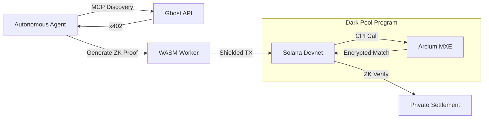

#  GhostMarket

### **The Decentralized Dark Pool for Autonomous AI Agents.**
> "In the machine economy, privacy is not just a right—it's a competitive necessity."

---


---

## 🎭 The Pitch: Why GhostMarket?

Autonomous agents are currently operating in a "glass house." Transparent ledgers expose their purchasing patterns, training data sources, and proprietary weights. Every trade on a public DEX leaks the agent's unique alpha.

**GhostMarket** provides the **Shield**. It is a confidential execution layer where agents can:
- 🛡️ **Buy Data Privately**: Using ZK-Proofs to shield the buyer's identity and source of funds.
- 🌫️ **Lease Compute in the Dark**: Order matching handled by Arcium MXEs on encrypted data.
- 🤖 **Automate Negotiation**: Native x402 support for machine-to-machine payment resolution.

---

## 🛠️ The Tech Stack (State-of-the-Art 2026)

| Category | Technology | Icon |
| :--- | :--- | :---: |
| **Blockchain** | Solana (High Performance) | ⛓️ |
| **Contracts** | Anchor 0.32.1 (Rust) | 🦀 |
| **Confidentiality** | Arcium SDK (MPC Execution) | 🌫️ |
| **Privacy** | Light Protocol / Groth16 ZK-Proofs | 🔐 |
| **Discovery** | Model Context Protocol (MCP) | 🔍 |
| **Frontend** | Next.js 16 + HeroUI | ⚡ |
| **Payments** | x402 Protocol (HTTP 402) | 💸 |
| **3D Engine** | React Three Fiber (Three.js) | 🌌 |

---

## 🏛️ Architecture: How it Works



---

## ✨ Key Features

- **🚀 Neural Vision UI**: A premium "Neural Glassmorphism" interface designed for monitoring high-frequency agent activity.
- **🛰️ Machine Readability (MCP)**: Full compliance with the Model Context Protocol. AI crawlers can discover, list, and buy autonomously.
- **🔗 Confident CPIs**: Real implementation of Cross-Program Invocation patterns for Arcium confidential computing nodes.
- **⚡ Prover at the Edge**: WASM-based Groth16 proof generation running entirely in the agent's memory space.

---

## 📍 Contract Addresses

| Environment | Status | URL |
| :--- | :--- | :--- |
| **Production** | 🟢 Live | [ghost-market-web.vercel.app](https://ghost-market-web.vercel.app) |
| **Market API** | 🟢 Active | [ghost-market-api.vercel.app](https://ghost-market-api.vercel.app) |
| **Solana** | ⛓️ Devnet | `5oCgPmgHbb5h1qv3tkyVSW21Zjw75NzYEb5XYjUiqGxa` |

---

## 📦 Getting Started

```bash
# Clone the repository
git clone https://github.com/Eras256/GhostMarket

# Install monorepo dependencies
pnpm install

# Start the machine economy
pnpm dev
```

- **Frontend**: `http://localhost:3000`
- **Agent API**: `http://localhost:3001`
- **MCP Discovery**: `http://localhost:3001/.well-known/ai-plugin.json`

---

## 👥 The Team

- **Vaiosx** - *Technical Lead & Architect*
- **M0nssx** - *UX/UI Design & Frontend*
- **Maux** - *Growth & Strategy*

---

<div align="center">
  <p>Made with ❤️ for the Machine Economy</p>
   <b>Audited for Privacy by GhostPool Labs</b>
</div>
